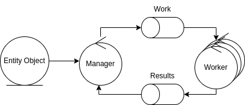

# Grid Search - Scala

This is a Scala implementation of a system for performing a grid search under [certain specifications](#).

The objective of this project is to benchmark the language on a real-world distributed system. See more in [docs](docs/README.md).

> TODO: Make common specification docs

The system is composed by a master node and a number of worker nodes.

## Deployment

The project is deployed using docker swarm, `make init` initializes it.

`make setup` will make other required initializations.

`make common_publish_local` publishes the common packets to the local maven repository.

### Local development

There are make scripts to run rabbit, graphana, manager and worker independently.
Such as: `run_rabbitmq`, `run_graphite`, `run_manager_local`, `run_worker_local`

### Local deployment

`make build` builds the docker images.

`make deploy` deploys the system.

### Remote deployment

`make build server` builds the docker images on the server.

`make deploy server` deploys the system on the server.

There are make scripts to tunnel the services such as: `tunnel_rabbitmq`, `tunnel_graphite`, `tunnel_cadvisor`, `tunnel_grafana`

> This will require ssh access to the server
