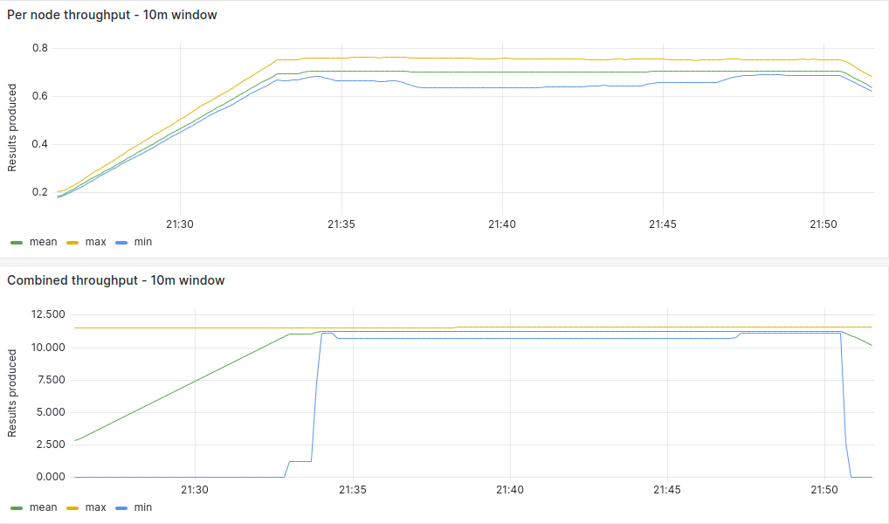
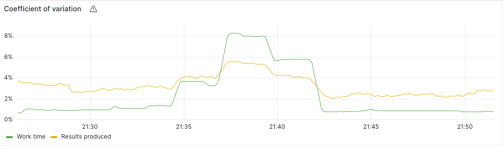
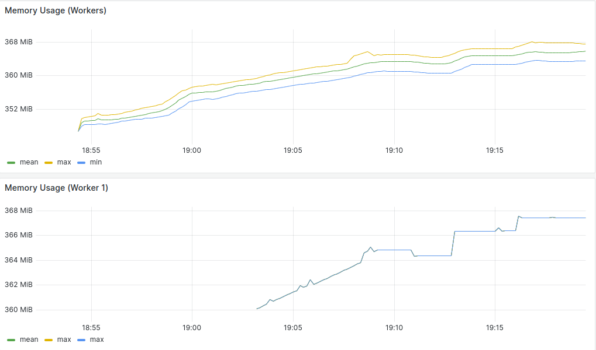
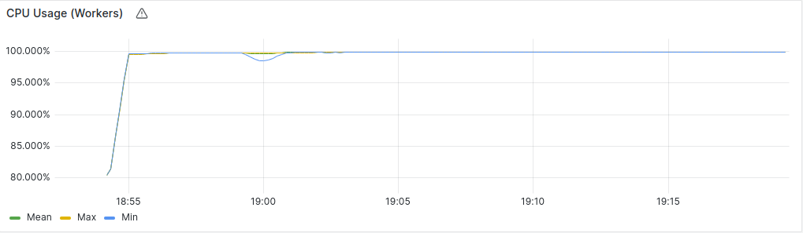

### 16 Nodes Measurements

#### Average Summary

- Worker Throughput: 0.70 Results/Second
- Combined Throughput: 11.2 Results/Second
- Work-time Variation: 3%
- Memory Usage: 365 MB/Worker
- CPU Usage: 99.9%/Worker (?)
- Completion Time: 25 Minutes

#### [Measurements](https://snapshots.raintank.io/dashboard/snapshot/F2kd3cimbmDzuRjOW5yp4DyfjaSQ8CcR?orgId=2)

