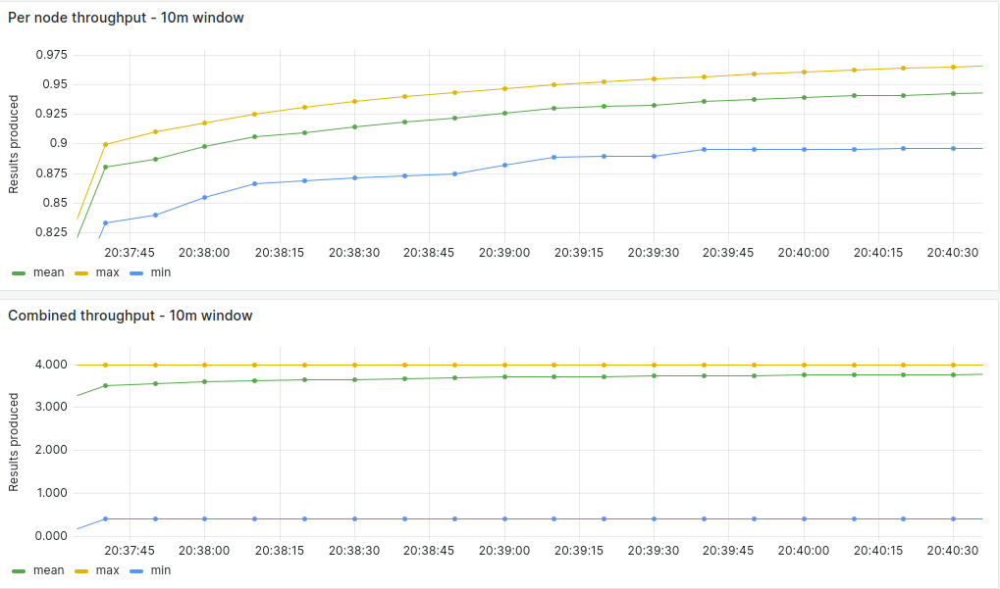
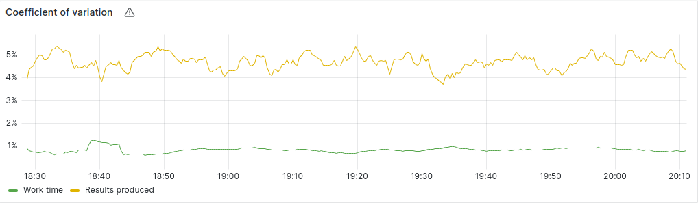
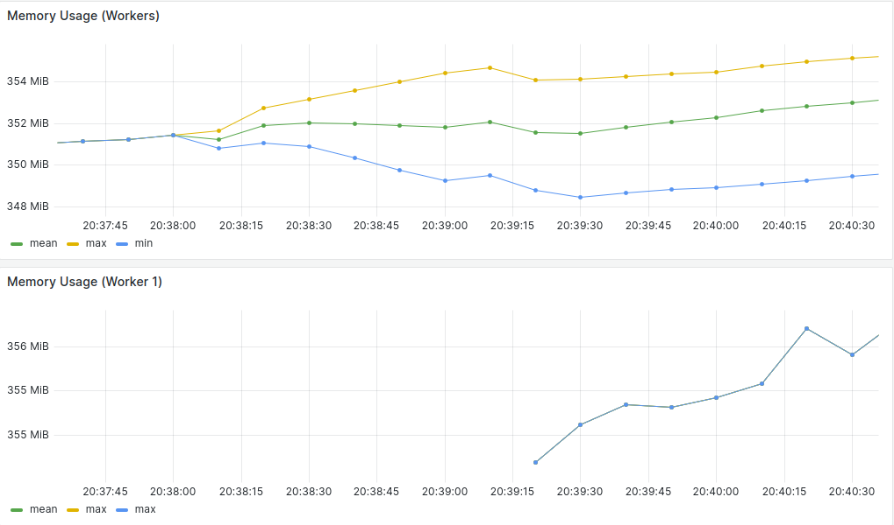
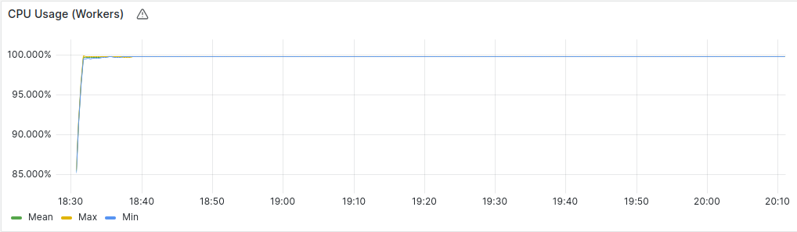

### 4 Nodes Measurements

#### Average Summary

- Worker Throughput: 7.3 Results/Minute
- Combined Throughput: 29.2 Results/Minute
- Work-time Variation: 0.9%
- Memory Usage: 380 MB/Worker
- CPU Usage: 99.9%/Worker (?)
- Completion Time: 90 Minutes (?)

#### [Measurements](https://snapshots.raintank.io/dashboard/snapshot/K25gJKj70mxfOqyLMXU1bT9Abx6klIyL?orgId=2)

