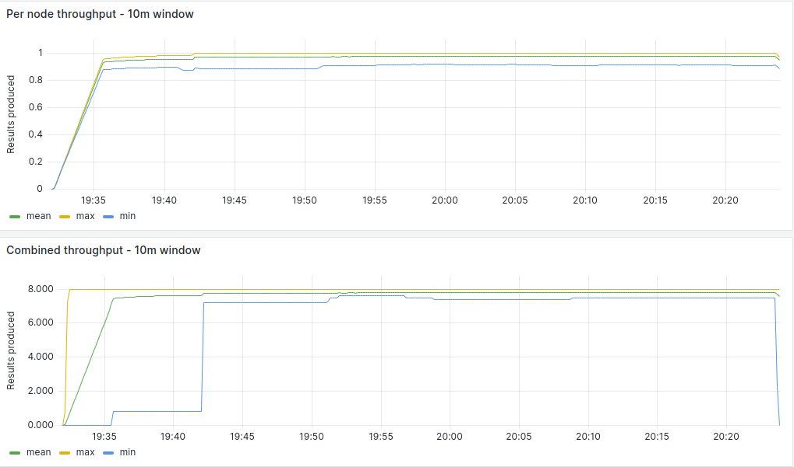
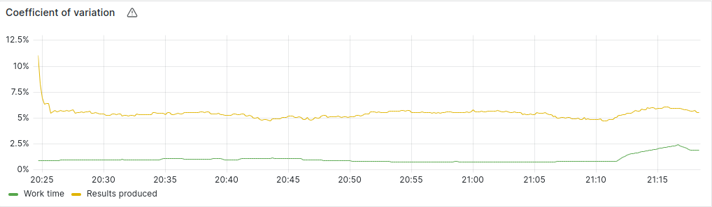
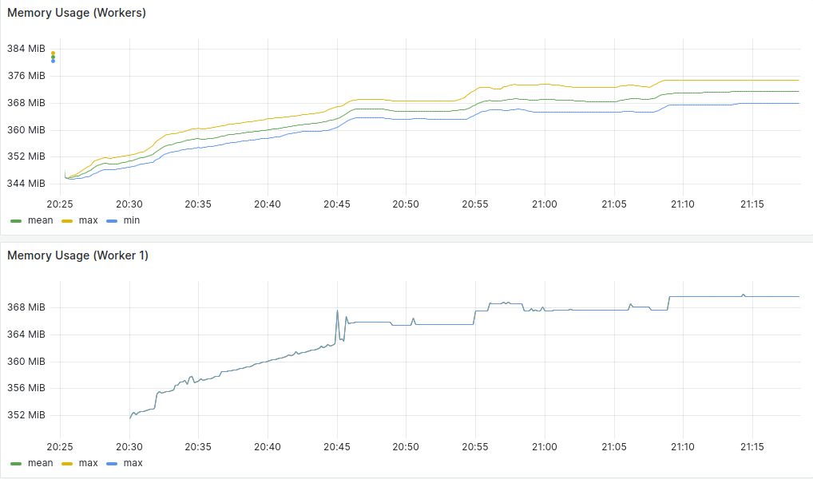
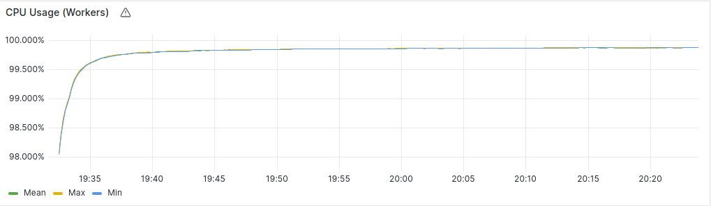

### 8 Nodes Measurements

#### Average Summary

- Worker Throughput: 7.25 Results/Minute
- Combined Throughput: 58.0 Results/Minute
- Work-time Variation: 1%
- Memory Usage: 370 MB/Worker
- CPU Usage: 99.9%/Worker (?)
- Completion Time: 60 Minutes (?)

#### [Measurements](https://snapshots.raintank.io/dashboard/snapshot/5WAU734JTE7zNomfJMf8lupdt0qn4vdh?orgId=2)

